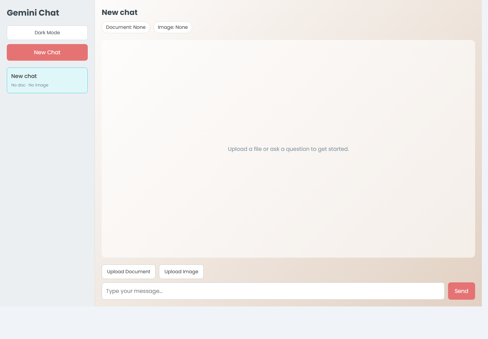

# Gemini Chatbot

A full-stack AI chatbot for chatting with documents and images. The app uses Gemini as the primary AI provider, with Groq and Hugging Face fallbacks for better resilience during outages or high-demand periods.


## Highlights

- Chat with uploaded PDF and TXT documents
- Upload images for visual context
- AI provider fallback flow with live status indicators
- Loading states for `Thinking...`, `Processing document...`, and `Using fallback AI...`
- Dark mode with saved preference
- Copy button for assistant replies
- Multi-chat sidebar with document and image context per chat
- Clear backend errors for invalid keys, empty PDFs, or unavailable providers

## Tech Stack

| Layer | Technology |
| --- | --- |
| Frontend | React, Vite, Axios |
| Backend | Node.js, Express, Multer |
| AI APIs | Google Gemini, Groq, Hugging Face |
| Document parsing | pdf-parse |

## Screenshots

### Laptop Dashboard


### Wide Dashboard



## Project Structure

```text
.
├── backend
│   ├── .env.example
│   ├── package.json
│   ├── package-lock.json
│   └── server.js
├── frontend
│   ├── src
│   │   ├── App.jsx
│   │   ├── index.css
│   │   └── main.jsx
│   ├── index.html
│   ├── package.json
│   ├── package-lock.json
│   └── vite.config.js
├── docs
│   └── screenshots
├── .gitignore
└── README.md
```

## Getting Started

### 1. Clone the repository

```bash
git clone https://github.com/Tejaswini-co/gemini-chatbot.git
cd gemini-chatbot
```

### 2. Install backend dependencies

```bash
cd backend
npm install
```

### 3. Configure environment variables

Create a `.env` file inside `backend`:

```bash
cp .env.example .env
```

Add your API keys:

```env
GEMINI_API_KEY=your_gemini_api_key
GROQ_API_KEY=your_groq_api_key
HF_API_KEY=your_hugging_face_api_key
PORT=3001
CLIENT_ORIGIN=http://localhost:5173

GEMINI_MODEL=gemini-2.5-flash
GROQ_MODEL=llama-3.3-70b-versatile
```

### 4. Install frontend dependencies

```bash
cd ../frontend
npm install
```

### 5. Run the app

Start the backend:

```bash
cd backend
npm start
```

Start the frontend in another terminal:

```bash
cd frontend
npm run dev
```

Open:

```text
http://localhost:5173
```

## API Overview

| Method | Endpoint | Description |
| --- | --- | --- |
| POST | `/api/chat/message` | Sends a chat message with optional document/image uploads |
| GET | `/api/chat/status/:chatId` | Returns the current processing status for a chat |

## Deployment Notes

- Do not commit `.env`; keep API keys in your hosting provider's environment variables.
- Deploy the backend to a Node-compatible host such as Render, Railway, Fly.io, or a VPS.
- Deploy the frontend to Vercel, Netlify, or any static hosting provider.
- Update `CLIENT_ORIGIN` in the backend to match the deployed frontend URL.
- Update `API_BASE_URL` in `frontend/src/App.jsx` if the backend URL changes.

## Security Notes

- `.env`, logs, `node_modules`, and build output are ignored by Git.
- Rotate any API key that was accidentally exposed in terminal output or screenshots.
- Uploaded files are processed in memory for the current session.

## License

This project is available for learning, experimentation, and portfolio use.
