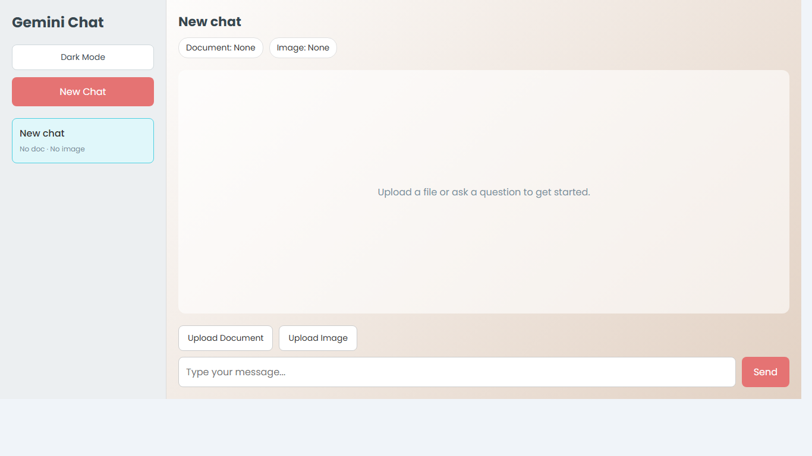

# Gemini Chatbot

A full-stack AI chatbot for chatting with documents and images. The app uses Gemini as the primary AI provider, with Groq and Hugging Face fallbacks for better resilience during outages or high-demand periods.



## Highlights

- Chat with uploaded PDF and TXT documents
- Upload images for visual context
- Vercel API routes for backend deployment
- AI fallback flow using Gemini, Groq, and Hugging Face
- Loading states for `Thinking...`, `Processing document...`, and `Using fallback AI...`
- Dark mode with saved preference
- Copy button for assistant replies
- Multi-chat sidebar with document and image context per chat

## Tech Stack

| Layer | Technology |
| --- | --- |
| Frontend | React, Vite, Axios |
| Backend | Vercel Serverless Functions, Node.js, Multer |
| AI APIs | Google Gemini, Groq, Hugging Face |
| Document parsing | pdf-parse |

## Project Structure

```text
.
├── api
│   └── chat
│       ├── message.js
│       └── status
│           └── [chatId].js
├── frontend
│   ├── src
│   │   ├── App.jsx
│   │   ├── index.css
│   │   └── main.jsx
│   ├── index.html
│   ├── package.json
│   ├── package-lock.json
│   └── vite.config.js
├── docs
│   └── screenshots
├── .gitignore
├── package.json
├── vercel.json
└── README.md
```

## Local Development

Install root dependencies:

```bash
npm install
```

Install frontend dependencies:

```bash
cd frontend
npm install
```

Create Vercel environment variables locally or in Vercel:

```env
GEMINI_API_KEY=your_gemini_api_key
GROQ_API_KEY=your_groq_api_key
HF_API_KEY=your_hugging_face_api_key
GEMINI_MODEL=gemini-2.5-flash
GROQ_MODEL=llama-3.3-70b-versatile
```

Run the frontend:

```bash
npm run dev
```

## Vercel Deployment

This project deploys frontend and backend together on Vercel.

Use these settings:

```text
Root Directory: ./
Framework Preset: Other
Build Command: npm run build
Output Directory: frontend/dist
Install Command: npm install
```

Add these Vercel environment variables:

```env
GEMINI_API_KEY=your_gemini_api_key
GROQ_API_KEY=your_groq_api_key
HF_API_KEY=your_hugging_face_api_key
GEMINI_MODEL=gemini-2.5-flash
GROQ_MODEL=llama-3.3-70b-versatile
```

The frontend calls the backend with relative `/api` routes, so no Render or separate backend host is required.

## API Overview

| Method | Endpoint | Description |
| --- | --- | --- |
| POST | `/api/chat/message` | Sends a chat message with optional document/image uploads |
| GET | `/api/chat/status/:chatId` | Returns loading status for the active chat |

## Security Notes

- Do not commit `.env` files.
- Keep API keys in Vercel environment variables.
- `node_modules`, logs, build output, and `.env` files are ignored by Git.
- Uploaded files are processed in memory during each request.

## License

This project is available for learning, experimentation, and portfolio use.
